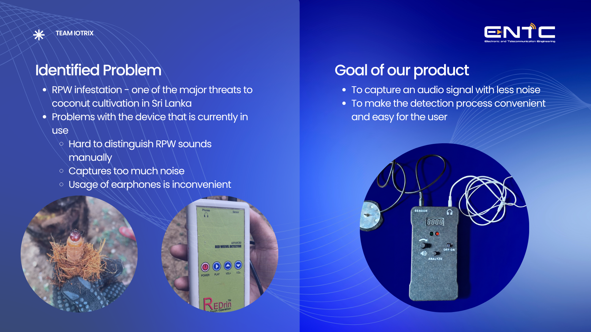
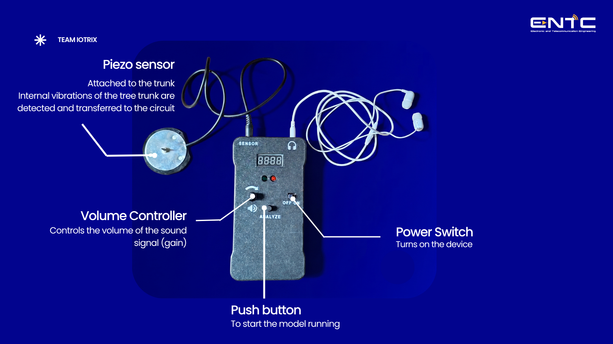
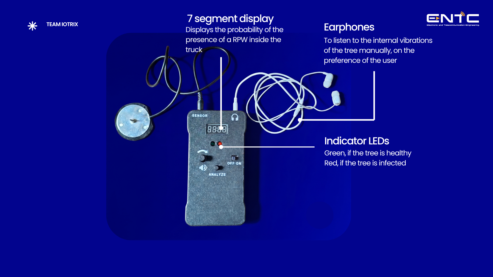
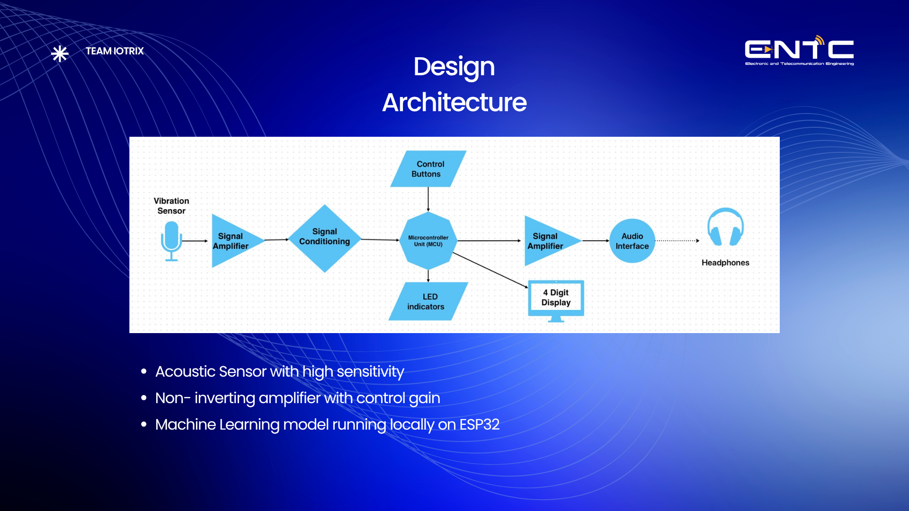

# 🌴 Red Palm Weevil Detector 

> **An AI-powered, low-cost edge computing device designed for the early detection of Red Palm Weevil (RPW) infestations in coconut trees.**

## 🎯 The Problem & Our Solution

The Red Palm Weevil is a devastating pest that destroys coconut palms from the inside out, making early visual detection nearly impossible. Traditional acoustic monitoring tools rely on manual listening via earphones, which are highly susceptible to ambient environmental noise and inconvenient for prolonged field use. 

**Our solution** is an AI-integrated, human-centric device that captures internal larval feeding sounds using a high-sensitivity acoustic probe. By processing these signals locally with a TinyML model, the device filters out background noise and provides a clear, real-time visual output of the tree's health status.

## ✨ Key Features

* **Precision Acoustic Filtering:** Utilizes a piezo-electric sensor coupled with a custom operational amplifier and frequency filter (800 Hz - 2.5 kHz) to isolate high-frequency larval crunching sounds.
* **Edge AI (TinyML):** Runs an ultra-lightweight, int8-quantized neural network locally on an ESP32 microcontroller. It achieves **88.8% accuracy**, requires only **19 KB of peak RAM**, and completes inference in ~145 ms—entirely offline.
* **Intuitive User Interface:** Eliminates the need for constant earphone monitoring with a 4-digit 7-segment display and status LEDs (Green for healthy, Red for infected). Manual audio monitoring is still available as an optional feature.

## 🏗️ Hardware Architecture

* **Processing Core:** ESP32-WROOM-32E / ESP32-S3 Microcontroller
* **Sensor:** High-sensitivity piezo-electric vibration probe
* **Analog Front-End:** Custom PCB with op-amp signal conditioning 
* **User I/O:** 7-segment display, LED indicators, tactile push-buttons, and rotary gain/volume control
* **Power Management:** 3.3V LDO regulator powered by an external AAA battery pack inside a ruggedized field enclosure

## 📄 Documentation
For complete details on the system architecture, budget analysis, and machine learning model, please reference the following project files:
* `Team Iotrix- EDP.pdf`
* `Team_Iotrix_EDP_Report.pdf`

## 👥 Team IoTrix 
*Department of Electronic & Telecommunication Engineering, University of Moratuwa*
* **Kaluarachchi K. A. P. R.**
* **Sasmitha K. A. P.**
* **Kothalawala D. H.**
* **Ranaweera R. K. M. D. T.**
